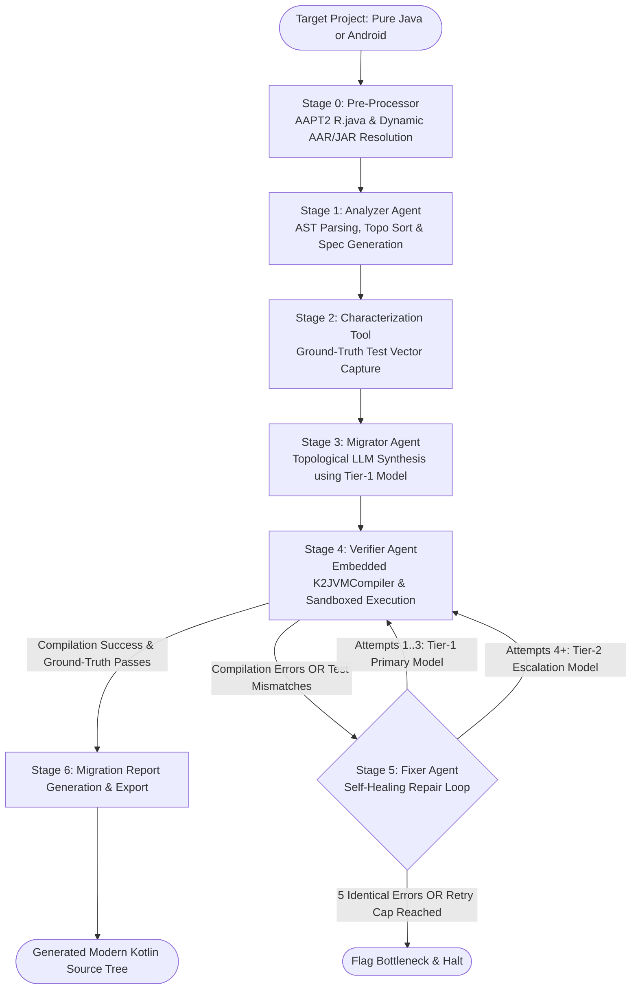

# 🚀 Apollo Agent — Autonomous Java-to-Kotlin Migration Engine

[](https://kotlinlang.org/)
[](https://openjdk.org/)
[](https://github.com/)
[](https://modelcontextprotocol.io/)
[](LICENSE)

**Apollo Agent** is an industrial-grade, multi-stage, stateful agentic system designed to autonomously modernize legacy Java codebases (including full Android applications and libraries) into clean, idiomatic Kotlin. 

Unlike naive single-pass AI converters that produce broken, uncompilable code with hallucinated APIs, Apollo employs a **closed-loop verification and repair graph**. By orchestrating static AST parsing, topological dependency resolution, automated AAPT2 resource symbol compilation, dynamic AAR/JAR dependency fetching, reflective ground-truth characterization testing, two-tier model routing, embedded Kotlin compilation, and self-healing error recovery, Apollo guarantees semantic equivalence and guaranteed compilation.

---

## 📑 Table of Contents
- [Architecture & Pipeline Workflow](#-architecture--pipeline-workflow)
- [Comprehensive Stage-by-Stage Breakdown](#-comprehensive-stage-by-stage-breakdown)
  - [Stage 0: Pre-Processor & Android Ecosystem](#0-stage-0--android-resource--dependency-pre-processor-aapt2tool--gradledependencyresolver)
  - [Stage 1: Analyzer Agent](#1-stage-1--analyzer-agent-analyzeragent)
  - [Stage 2: Characterization Tool](#2-stage-2--characterization-tool-characterizationtool)
  - [Stage 3: Migrator Agent](#3-stage-3--migrator-agent-migratoragent)
  - [Stage 4: Verifier Agent](#4-stage-4--verifier-agent-verifieragent)
  - [Stage 5: Fixer Agent](#5-stage-5--fixer-agent-fixeragent)
  - [Stage 6: Orchestrator & Resume Manager](#6-stage-6--orchestrator--resume-manager-modernizationgraph--resumemanager)
- [Intelligent 2-Tier LLM Routing & Resilience](#-intelligent-2-tier-llm-routing--resilience)
- [Android App & Framework Support](#-android-app--framework-support)
- [MCP / REST HTTP Integration](#-mcp--rest-http-integration)
- [Knowledge Base & Migration Patterns](#-knowledge-base--migration-patterns)
- [Project Directory Structure](#-project-directory-structure)
- [Setup & Environment Configuration](#-setup--environment-configuration)
- [Running Apollo](#-running-apollo)
- [Testing Guide & Verification Strategy](#-testing-guide--verification-strategy)
- [License](#-license)

---

## 📐 Architecture & Pipeline Workflow

Apollo operates as a 6-node stateful workflow engine (`ModernizationGraph`). Execution state is passed through an immutable `GraphState` data model, transitioning code from discovery to final verification.



---

## 🧩 Comprehensive Stage-by-Stage Breakdown

### 0. 📦 Stage 0 — Android Resource & Dependency Pre-Processor (`Aapt2Tool` & `GradleDependencyResolver`)
* **AAPT2 Resource Compilation**: For Android targets, executes Android SDK `aapt2 compile` and `aapt2 link` to produce an authentic `R.java` symbol file directly from XML layouts, strings, and drawables.
* **Gradle Dependency Parsing**: Automatically scans `build.gradle`, `build.gradle.kts`, and `libs.versions.toml` to extract Maven coordinates for all project dependencies.
* **Dynamic AAR/JAR Resolution**: Resolves remote artifacts (e.g., `androidx.appcompat`, `com.google.android.material`) via Maven Central and Google Maven, extracts nested `classes.jar` from `.aar` bundles, and populates the compilation classpath under `libs/android-stubs/androidx-cache/`.

### 1. 🔍 Stage 1 — Analyzer Agent (`AnalyzerAgent`)
* **AST Parsing**: Uses `javaparser-symbol-solver-core` to extract package declarations, class hierarchies, fields, methods, annotations, and inter-class dependencies.
* **Topological Sort**: Executes Kahn's algorithm to resolve module dependencies into a strict DAG sequence (`topologicalOrder`), ensuring base models are migrated before dependent services and UI activities.
* **Architectural Summarization**: Interacts with the LLM to generate comprehensive architectural specifications (`.md` and `.json`) detailing class contracts, state management, and business logic under `reports/specs/<ClassName>/`.

### 2. 🧪 Stage 2 — Characterization Tool (`CharacterizationTool`)
* **Dynamic Java Compilation**: In-process compilation of original legacy Java source files using the system JDK `JavaCompiler`.
* **Input Vector Generation**: Dynamically constructs boundary, nullability, empty collection, and numeric test vectors.
* **Reflective Execution**: Reflectively executes all public methods, capturing return values and stringified exceptions.
* **Ground-Truth Baseline**: Persists inputs and expected outputs as JSON files under `reports/characterization/<ClassName>-char-tests.json` to act as an unyielding behavioral benchmark for the migrated Kotlin code.

### 3. ⚙️ Stage 3 — Migrator Agent (`MigratorAgent`)
* **Dependency-Aware Sequential Migration**: Synthesizes Kotlin code in topological order so that downstream modules have direct visibility into the newly migrated Kotlin implementations of their dependencies.
* **Context Synthesis**: Injects the Java source, AST specifications, curated Knowledge Base patterns, and previously migrated Kotlin files into the migration prompt.
* **Tier-1 Primary Model Usage**: Always utilizes the primary LLM (`OLLAMA_MODEL_PRIMARY=qwen3-coder:30b`) for initial transformations.
* **File Output**: Writes generated code to `migrated-src/<packagePath>/<ClassName>.kt`.

### 4. ✅ Stage 4 — Verifier Agent (`VerifierAgent`)
* **Embedded Kotlin Compiler**: Uses Kotlin's in-process `K2JVMCompiler` with sandboxed classpath isolation (`build/sandbox-compiled-kotlin`).
* **Runtime Sandbox Execution**: Loads compiled Kotlin classes via custom `URLClassLoader` and executes Stage 2 ground-truth test vectors against them.
* **Symmetric Validation**: Compares runtime outputs, gracefully handling data class string formatting differences and Android SDK `STUB!` sentinels.
* **Per-Module Status Tracking**: Accurately tracks statuses (`VERIFIED`, `FAILED`, `PARTIAL`) per individual module rather than marking all modules failed if a single class fails.

### 5. 🛠️ Stage 5 — Fixer Agent (`FixerAgent`)
* **Diagnostic-Driven Patching**: Feeds exact Kotlin compiler error messages, line numbers, and characterization test diffs back to the LLM.
* **Adaptive 2-Tier Model Routing**:
  - **Attempts 0–2**: Uses Tier-1 Primary model (`qwen3-coder:30b`).
  - **Attempts 3+**: Automatically falls back for that specific module to Tier-2 model (`qwen3.8:27b`).
* **Intelligent Watchdogs**:
  - **5-Identical-Error Watchdog**: If a module produces the identical compiler error 5 times in a row, the pipeline halts immediately and flags an LLM bottleneck to avoid burning compute.
  - **3-Watchdog-Abort Watchdog**: If 3 LLM calls timeout consecutively, the process stops immediately.

### 6. 📊 Stage 6 — Orchestrator & Resume Manager (`ModernizationGraph` & `ResumeManager`)
* **Incremental Resume**: If a migration is restarted on a previously attempted project, Apollo automatically inspects existing artifacts (specs, characterization tests, Kotlin files, verification logs). If valid, it skips already-completed stages and resumes directly from the failed stage.
* **Fresh Resume Budget**: Resets pipeline-level pass counts and per-module repair counters on resume so modules can benefit from newly updated Knowledge Base rules.
* **Report Generation**: Exports detailed Markdown (`reports/migration-summary.md`) and JSON (`reports/migration-report-<timestamp>.json`) reports.
* **Clean JVM Exit**: Executes `kotlin.system.exitProcess(0)` upon pipeline completion or bottleneck termination, preventing Gradle daemon hangs.

---

## 🧠 Intelligent 2-Tier LLM Routing & Resilience

Apollo uses a resilient, high-throughput LLM routing engine implemented in `LlmConfig.kt`:

| Tier / Feature | Model / Target | Purpose & Behavior |
| :--- | :--- | :--- |
| **Tier 1 (Primary)** | `qwen3-coder:30b` | Specialized coding model used for all Stage 3 initial migrations and Fixer repair attempts 0 to 2. |
| **Tier 2 (Fallback)** | `qwen3.8:27b` | Generalist fallback model automatically invoked when a module fails 3 consecutive repair attempts. |
| **Instant-Trip Circuit Breaker** | Groq / Cloud API | Trips immediately on **any non-success response** (429 rate limit, 404, 500, network error) and locks out Groq for the remainder of the run. |
| **Stream Watchdog** | Active Stream Closer | Terminates unresponsive HTTP streams and reader threads if an LLM fails to stream tokens within the configured timeout window. |

---

## 🤖 Android App & Framework Support

Apollo natively handles complex Android applications (containing `Activity`, `View`, `SQLiteOpenHelper`, `BroadcastReceiver`, etc.):

1. **Android SDK Resolution**: Automatically searches local environments for Android SDK platforms (`android-30` through `android-35`) and `aapt2`.
2. **Android Stub Framework**: Employs `libs/android-stubs/android.jar` to provide compile-time symbols for all Android framework classes.
3. **Symmetric Stub Validation**: When methods calling Android framework APIs throw `RuntimeException("Stub!")`, Apollo records a `STUB!` sentinel. If both Java baseline and migrated Kotlin yield `STUB!`, behavioral symmetry is confirmed as **PASS**.

---

## 🌐 MCP / REST HTTP Integration

Apollo embeds a lightweight **Ktor Netty HTTP server** exposing migration tools for external AI IDEs (Cursor, Antigravity, Claude Desktop).

### Starting the Server
```bash
./gradlew run --args="--server"
```

### Available Endpoints
* `GET /health`: Liveness probe. Returns `{ "status": "UP", "service": "Apollo-MCP" }`.
* `GET /mcp/tools`: Returns the catalog of callable tools.
* `POST /mcp/execute`: Executes a tool (`analyze_repo`, `run_migration`, `get_job_status`, `get_module_report`, `list_migration_patterns`).

---

## 📚 Knowledge Base & Migration Patterns

The pattern repository (`knowledge-base/java-to-kotlin-patterns.json`) guides LLMs with curated before/after migration templates:
* **`STRUCTURE`**: POJO $\rightarrow$ Kotlin `data class`.
* **`UTILITY`**: Static utility class $\rightarrow$ Kotlin `object` singleton or top-level extension functions.
* **`NULL_SAFETY`**: Explicit null checks $\rightarrow$ Elvis operators (`?:`), safe calls (`?.`), and `requireNotNull`.
* **`ANDROID_UI`**: `findViewById` $\rightarrow$ ViewBinding / Synthetic property patterns.
* **`SQLITE`**: `Cursor` and `SQLiteDatabase` raw queries $\rightarrow$ idiomatic `.use { }` blocks and extension queries.

---

## 📁 Project Directory Structure

```
Apollo-agent/
├── .env                               # LLM credentials & routing configuration
├── build.gradle.kts                   # Kotlin 2.3.21 & Gradle build configuration
├── PROJECT_INDEX.md                   # AI Assistant & Copilot Operational Index
├── knowledge-base/
│   └── java-to-kotlin-patterns.json   # Curated migration pattern catalog
├── sample-legacy/                     # Included Java testbed (5 legacy modules)
│   └── src/main/java/com/example/legacy/
│       ├── User.java                  # Legacy POJO
│       ├── StringUtils.java           # Static utility
│       ├── TrickyMath.java            # Numeric boundary edge cases
│       ├── AsyncDataLoader.java       # Callback-based async handler
│       └── UserService.java           # Business service with mutable state
├── src/
│   ├── main/kotlin/com/issam/apollo/
│   │   ├── Main.kt                    # CLI Entrypoint & process exit handler
│   │   ├── agents/                    # Core pipeline agents (Analyzer, Migrator, Verifier, Fixer)
│   │   ├── config/                    # LlmConfig with 2-tier routing & circuit breakers
│   │   ├── orchestrator/              # ModernizationGraph state machine & ResumeManager
│   │   ├── state/                     # GraphState & ModuleStatus immutable models
│   │   └── tools/                     # JavaParser AST, AAPT2, Gradle resolver, K2JVMCompiler
│   └── test/kotlin/com/issam/apollo/  # Comprehensive unit and integration test suites
├── migrated-src/                      # Output directory for generated Kotlin source files
└── reports/                           # Output directory for specs, char tests, and summary reports
```

---

## ⚙️ Setup & Environment Configuration

### Prerequisites
* **JDK 17+** (JDK 17 or JDK 21 recommended).
* **Ollama** running locally or on an accessible network instance with the required models:
  ```bash
  ollama pull qwen3.8:27b
  ollama pull qwen3-coder:30b
  ```

### Configuration (`.env`)
Create or edit `.env` in the repository root:
```env
# Primary LLM Provider: groq | ollama
LLM_PROVIDER=ollama
LLM_MODEL=openai/gpt-oss-120b

# Ollama 2-Tier Configuration
OLLAMA_BASE_URL=http://localhost:11434/v1
OLLAMA_API_KEY=
OLLAMA_MODEL_PRIMARY=qwen3-coder:30b
OLLAMA_MODEL_ESCALATION=qwen3.8:27b

# Groq Cloud Fallback (optional)
GROQ_API_KEY=your_groq_api_key_here

# Execution parameters
SANDBOX_DOCKER_ENABLED=false
MAX_RETRY_COUNT=10
```

---

## 💻 Running Apollo

### 1. Migrate a Project
```bash
# Migrate the built-in sample legacy project
./gradlew run --args="sample-legacy"

# Migrate a custom project
./gradlew run --args="D:/Projects/MyAndroidApp"
```

### 2. Resume an Interrupted Migration
```bash
# Automatically resumes from the last completed stage
./gradlew run --args="--resume sample-legacy"
```

### 3. Start MCP REST Server
```bash
./gradlew run --args="--server"
```

---

## 🧪 Testing Guide & Verification Strategy

Apollo contains both fast unit tests and end-to-end integration test suites:

### Recommended: Agent-by-Agent Testing (Fast & Isolated)
Run test suites individually for fast verification (~10–20 seconds each):
```bash
# 1. Analyzer Agent AST parsing & topo sort
./gradlew test --tests com.issam.apollo.agents.AnalyzerAgentTest

# 2. LLM Config 2-tier routing & circuit breaker
./gradlew test --tests com.issam.apollo.config.LlmConfigTest

# 3. Resume Manager stage validation & state recovery
./gradlew test --tests com.issam.apollo.orchestrator.ResumeManagerTest

# 4. Fixer Agent self-healing repair & retry cap logic
./gradlew test --tests com.issam.apollo.agents.FixerAgentTest
```

### Full End-to-End Test Suites (Invokes Live LLMs)
> ⚠️ **Note:** `VerifierAgentTest` and `OrchestratorTest` execute live migration and reflective verification across all 5 sample legacy modules using Ollama models. These tests take **5–10 minutes** depending on hardware.

```bash
# End-to-end Verifier Agent test with live compilation
./gradlew test --tests com.issam.apollo.agents.VerifierAgentTest

# End-to-end Graph Orchestrator execution
./gradlew test --tests com.issam.apollo.orchestrator.OrchestratorTest
```

---

## 📄 License

Distributed under the MIT License. See `LICENSE` for details.
