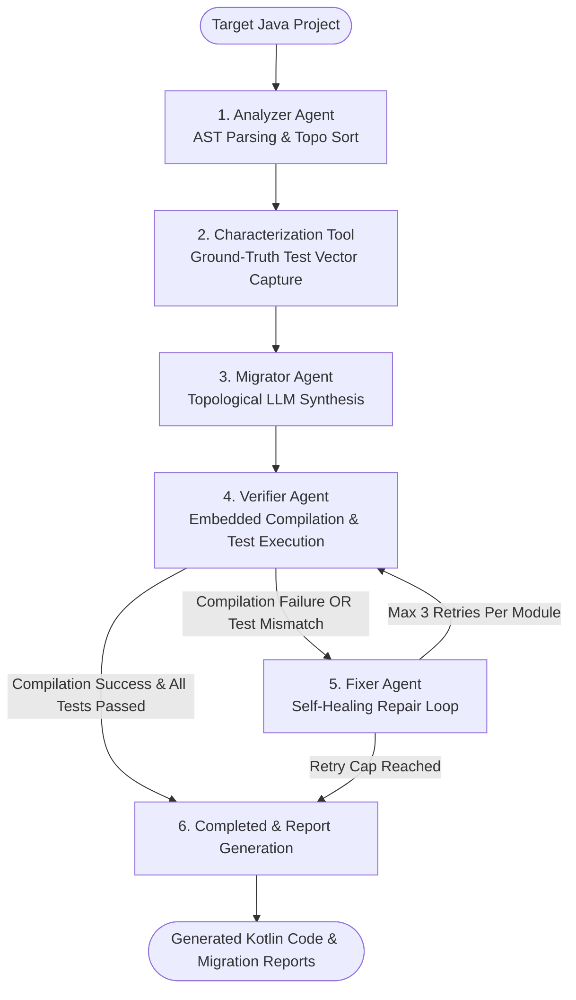

# 🚀 Apollo Agent — Autonomous Java-to-Kotlin Migration Engine

[](https://kotlinlang.org/)
[](https://openjdk.org/)
[](https://github.com/)
[](https://modelcontextprotocol.io/)
[](LICENSE)

**Apollo Agent** is a multi-stage, stateful agentic pipeline designed to autonomously transform legacy Java codebases into modern, idiomatic Kotlin. By combining static AST parsing, topological dependency resolution, reflective ground-truth characterization testing, LLM-based code synthesis, embedded Kotlin compilation, and self-healing repair loops, Apollo guarantees high-fidelity, compilable, and semantics-preserving migrations.

---

## 📐 Architecture & Pipeline Workflow

Apollo operates as a 6-node stateful workflow graph (`ModernizationGraph`). Each stage transforms and updates a shared `GraphState` object, driving modules from discovery through verification.



---

## 🧩 Comprehensive Stage Breakdown

### 1. 🔍 Stage 1 — Analyzer Agent (`AnalyzerAgent`)
* **AST Analysis**: Uses JavaParser (`javaparser-symbol-solver-core`) to extract package declarations, imports, fields, methods, and cross-module dependencies.
* **Topological Sort**: Executes Kahn's algorithm to resolve module dependencies into a topologically sorted migration order (`topologicalOrder`), ensuring dependency classes are migrated before dependent classes.
* **LLM Summarization**: Invokes Koog `AIAgent` instances to generate structured business-logic summaries for each module.
* **Artifact Generation**: Outputs per-module specification files (`.md` and `.json`) under `reports/specs/<ClassName>/` and writes `reports/topo-order.md`.

### 2. 🧪 Stage 2 — Characterization Tool (`CharacterizationTool`)
* **Dynamic Compilation**: Compiles original legacy Java source files in-process using system `javac`.
* **Input Vector Generation**: Dynamically constructs standard and edge-case input vectors (including `null`, empty strings, and boundary numbers).
* **Reflective Execution**: Executes public methods of Java classes reflectively and captures baseline execution results and stringified exceptions.
* **Ground-Truth Preservation**: Persists ground-truth test cases as JSON files in `reports/characterization/` to serve as verification benchmarks.

### 3. ⚙️ Stage 3 — Migrator Agent (`MigratorAgent`)
* **Sequential Topological Migration**: Migrates modules strictly in dependency order to provide downstream modules with context from previously transformed Kotlin code.
* **Context Synthesis**: Combines Java AST specs, raw Java source code, curated Knowledge Base migration patterns, and previously migrated Kotlin dependency source code into LLM prompts.
* **Multi-LLM & Fallback**: Leverages Gemini 1.5/2.0 or Groq models via Koog framework, falling back to a rule-based Kotlin code generator when LLM providers are offline.
* **Source Export**: Writes generated Kotlin code files to `migrated-src/<packagePath>/<ClassName>.kt`.

### 4. ✅ Stage 4 — Verifier Agent (`VerifierAgent`)
* **Embedded Compilation**: Compiles generated Kotlin files using Kotlin's embedded JVM compiler (`K2JVMCompiler`) in a sandboxed execution environment (`build/sandbox-compiled-kotlin`).
* **Runtime Verification**: Dynamically loads compiled Kotlin classes into a custom `URLClassLoader` and executes Stage 2 ground-truth test vectors against them.
* **Semantics Validation**: Compares actual Kotlin outputs against original Java baseline outputs, accounting for string formatting and POJO vs. Kotlin data class `toString` / `hashCode` differences.

### 5. 🛠️ Stage 5 — Fixer Agent (`FixerAgent`)
* **Automated Self-Healing**: Triggered automatically when verification or compilation fails.
* **Targeted Patching**: Feeds compiler diagnostic logs, characterization test failures, module specifications, and broken Kotlin code back into the LLM to generate surgical repairs.
* **Loop Prevention**: Enforces a strict cap of **3 retries per module** (`regenCounters`). If a module reaches the retry limit, it is marked `FAILED` and pipeline execution completes without hanging.

### 6. 📊 Stage 6 — Orchestrator & Reporting (`ModernizationGraph` & `Main.kt`)
* **State Machine**: Orchestrates node transitions, state updates, and failure recovery paths across all agents.
* **Report Generation**: Exports detailed JSON reports (`reports/migration-report-<timestamp>.json`) and a Markdown summary (`reports/migration-summary.md`) detailing per-module statuses, compile status, characterization test metrics, and retry counts.

---

## 🌐 Model Context Protocol (MCP) Integration

Apollo includes a built-in **Model Context Protocol (MCP) Server** powered by Ktor Netty, allowing AI development environments (e.g., Cursor, Antigravity, Claude Desktop) to invoke Apollo tools remotely.

### Starting the MCP Server
```bash
./gradlew run --args="--server"
```
*Port:* `8080` (default)

### Server Endpoints

#### `GET /mcp/tools`
Returns the list of available MCP tools and JSON schemas.
```json
[
  {
    "name": "migrate_java_project",
    "description": "Transforms a legacy Java codebase to modern Kotlin using Apollo agent stages",
    "inputSchema": {
      "type": "object",
      "properties": {
        "projectPath": { "type": "string" }
      }
    }
  }
]
```

#### `POST /mcp/execute`
Executes the Apollo modernization pipeline on a target path.
*Request Body:*
```json
{
  "method": "migrate_java_project",
  "projectPath": "sample-legacy"
}
```
*Response Body:*
```json
{
  "status": "SUCCESS",
  "message": "Pipeline execution completed for sample-legacy",
  "details": "Migrated 3 file(s) with 5 report entries."
}
```

---

## 📚 Knowledge Base (`MigrationPatterns`)

Apollo utilizes a curated pattern database (`knowledge-base/java-to-kotlin-patterns.json`) to guide LLM transformations toward idiomatic Kotlin practices:

| Pattern Category | Description & Applied Transformations |
| :--- | :--- |
| **`STRUCTURE`** | Converts Java POJOs with getters/setters/equals/hashCode into concise Kotlin `data class` constructs. |
| **`UTILITY`** | Converts static utility classes with private constructors into Kotlin `object` singletons or extension functions. |
| **`NULL_SAFETY`** | Replaces explicit `if (x != null)` checks with Elvis operators (`?:`), safe calls (`?.`), or `requireNotNull`. |
| **`COLLECTIONS`** | Replaces legacy `for` loops and `ArrayList` mutations with Kotlin collection extensions (`filter`, `map`, `find`). |
| **`RESOURCE_MANAGEMENT`** | Converts Java `try-with-resources` blocks into Kotlin `.use { }` scope calls. |

---

## 📁 Repository Directory Structure

```
Apollo-agent/
├── build.gradle.kts                   # Gradle build configuration & dependencies
├── settings.gradle.kts                # Project setting configurations
├── .env                               # Environment variables (API keys, LLM providers)
├── knowledge-base/
│   └── java-to-kotlin-patterns.json   # Curated Java-to-Kotlin migration pattern library
├── sample-legacy/                     # Sample target Java application
│   └── src/main/java/com/example/legacy/
│       ├── User.java                  # Java POJO class
│       ├── StringUtils.java           # Static utility class
│       └── UserService.java           # Service layer with business logic & state
├── src/
│   ├── main/kotlin/com/issam/apollo/
│   │   ├── Main.kt                    # CLI entry point & console report renderer
│   │   ├── agents/
│   │   │   ├── AnalyzerAgent.kt       # Stage 1: AST parsing, topo sort & spec summarization
│   │   │   ├── MigratorAgent.kt       # Stage 3: Topological Kotlin synthesis agent
│   │   │   ├── VerifierAgent.kt       # Stage 4: Sandboxed compilation & test execution
│   │   │   └── FixerAgent.kt          # Stage 5: Self-healing repair agent
│   │   ├── config/
│   │   │   └── LlmConfig.kt           # Multi-provider configuration (Gemini / Groq)
│   │   ├── knowledge/
│   │   │   └── MigrationPatterns.kt   # Knowledge base loader & prompt formatter
│   │   ├── mcp/
│   │   │   └── McpServer.kt           # Ktor MCP Server implementation
│   │   ├── orchestrator/
│   │   │   └── ModernizationGraph.kt  # Stage 6: Graph engine & workflow node manager
│   │   ├── state/
│   │   │   └── GraphState.kt          # Shared immutable state & status data models
│   │   └── tools/
│   │       ├── JavaAstTool.kt         # JavaParser wrapper & Kahn's topo sort implementation
│   │       ├── CharacterizationTool.kt# Reflective Java compiler & ground-truth test capture
│   │       ├── KotlinCompileTool.kt   # Embedded Kotlin compiler wrapper (K2JVMCompiler)
│   │       └── SandboxRunner.kt       # Sandboxed process & optional Docker container runner
│   └── test/kotlin/com/issam/apollo/ # Unit & integration test suites
│       ├── agents/
│       ├── orchestrator/
│       └── tools/
├── migrated-src/                      # Transformed Kotlin output source tree
└── reports/                           # Pipeline runtime artifacts, specs, and summaries
    ├── specs/                         # Per-module Markdown & JSON specifications
    ├── characterization/              # Per-module ground-truth JSON test cases
    ├── verification/                  # Per-module verification execution logs
    ├── topo-order.md                  # Module migration sequence report
    └── migration-summary.md           # Final pipeline summary report
```

---

## 🛠️ Setup & Execution Guide

### Prerequisites
* **Java Development Kit (JDK)**: Version 17 or higher.
* **Gradle**: 8.x (or use the provided `./gradlew` wrapper).

### Environment Setup
Create or update the `.env` file in the root directory:

```env
# Provider Options: gemini | groq
LLM_PROVIDER=gemini

# Gemini Configuration
GEMINI_API_KEY=your_gemini_api_key_here
LLM_MODEL=gemini-1.5-pro

# Groq Configuration (Optional)
GROQ_API_KEY=your_groq_api_key_here
```

---

## 💻 Running Apollo

### 1. Execute CLI Migration
To run the full 6-stage migration pipeline on a target project directory:

```bash
# Migrate the included sample project
./gradlew run --args="sample-legacy"

# Migrate a custom Java project
./gradlew run --args="D:/Projects/MyLegacyApp"
```

### 2. Start MCP Server Mode
To start Apollo as a Model Context Protocol background service:

```bash
./gradlew run --args="--server"
```

### 3. Run Test Suite
To execute all agent and tool unit/integration tests:

```bash
./gradlew test
```

---

## 🔄 Transformation Showcase (Before & After)

### Legacy Java POJO (`User.java`)
```java
package com.example.legacy;

public class User {
    private String id;
    private String username;
    private String email;
    private int age;

    public User(String id, String username, String email, int age) {
        this.id = id;
        this.username = username;
        this.email = email;
        this.age = age;
    }

    public String getId() { return id; }
    public void setId(String id) { this.id = id; }
    public String getUsername() { return username; }
    public void setUsername(String username) { this.username = username; }
    public String getEmail() { return email; }
    public void setEmail(String email) { this.email = email; }
    public int getAge() { return age; }
    public void setAge(int age) { this.age = age; }
}
```

### Apollo Modernized Kotlin Data Class (`User.kt`)
```kotlin
package com.example.legacy

/**
 * Modernized by Apollo Agent (Stage 3 Migrator)
 * Pattern: POJO -> Kotlin Data Class
 */
data class User(
    var id: String? = null,
    var username: String? = null,
    var email: String? = null,
    var age: Int = 0
)
```

---

## 📜 Reports & Output Artifacts

Following pipeline completion, summary artifacts are saved to `reports/`:

* **`reports/migration-summary.md`**: Human-readable Markdown summary detailing pipeline status, compilation status, test pass rates, and module regeneration counts.
* **`reports/migration-report-<timestamp>.json`**: Machine-readable JSON output containing stage reports and metrics.
* **`reports/topo-order.md`**: Dependency analysis table and topological ordering.
* **`reports/verification/verification-summary.md`**: Test pass/fail statistics for ground-truth characterization suites.

---

## 📄 License

Distributed under the MIT License. See `LICENSE` for details.
