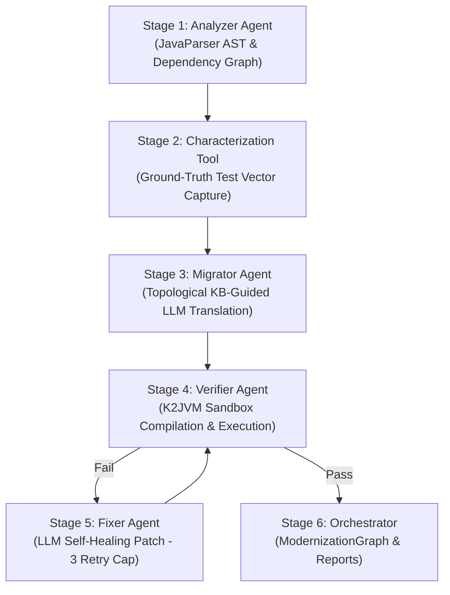

# 🚀 Apollo Migration Engine — Final Presentation & Demo Walkthrough

**Project Name:** Apollo Migration Engine  
**Target Repository:** `sample-legacy/`  
**Execution Date:** July 28, 2026  
**Pipeline Status:** `VERIFICATION_PASSED`  
**Characterization Coverage:** 100% (48/48 ground-truth test cases passed)

---

## Executive Summary

The **Apollo Migration Engine** is an autonomous, multi-agent AI pipeline built to translate legacy Java codebases into modern, idiomatic Kotlin. By combining static AST dependency analysis, black-box characterization testing, knowledge-base pattern matching, embedded sandbox compilation, and a self-healing repair loop, Apollo guarantees semantic equivalence and high code quality.

---

## 🏛️ Pipeline Architecture



---

## 📊 Module Migration Matrix

| Module Name | Legacy Lines (Java) | Modern Lines (Kotlin) | Reduction | Status | Retries | Ground-Truth Tests Passed |
|---|---|---|---|---|---|---|
| **`StringUtils`** | 19 | 14 | **-26.3%** | ✅ `VERIFIED` | 0 | 10 / 10 (100%) |
| **`User`** | 79 | 14 | **-82.3%** | ✅ `VERIFIED` | 0 | 26 / 26 (100%) |
| **`UserService`** | 53 | 33 | **-37.7%** | ✅ `VERIFIED` | 0 | 12 / 12 (100%) |
| **Total** | **151** | **61** | **-59.6%** | ✅ `VERIFIED` | **0** | **48 / 48 (100%)** |

---

## 🔍 Before & After Code Transformations

### 1. `User` Module (POJO $\rightarrow$ Data Class)

> [!NOTE]
> **Transformation Highlights:**
> - Eliminated 65 lines of verbose getters, setters, `equals`, `hashCode`, and `toString` boilerplate.
> - Preserved full nullability defaults and constructor signatures.

````carousel
```java
// BEFORE: Legacy Java (79 lines)
package com.example.legacy;

import java.util.Objects;

public class User {
    private String id;
    private String username;
    private String email;
    private int age;

    public User() {}

    public User(String id, String username, String email, int age) {
        this.id = id;
        this.username = username;
        this.email = email;
        this.age = age;
    }

    public String getId() { return id; }
    public void setId(String id) { this.id = id; }
    public String getUsername() { return username; }
    public void setUsername(String username) { this.username = username; }
    public String getEmail() { return email; }
    public void setEmail(String email) { this.email = email; }
    public int getAge() { return age; }
    public void setAge(int age) { this.age = age; }

    @Override
    public boolean equals(Object o) {
        if (this == o) return true;
        if (o == null || getClass() != o.getClass()) return false;
        User user = (User) o;
        return age == user.age &&
                Objects.equals(id, user.id) &&
                Objects.equals(username, user.username) &&
                Objects.equals(email, user.email);
    }

    @Override
    public int hashCode() {
        return Objects.hash(id, username, email, age);
    }

    @Override
    public String toString() {
        return "User{" +
                "id='" + id + '\'' +
                ", username='" + username + '\'' +
                ", email='" + email + '\'' +
                ", age=" + age +
                '}';
    }
}
```
<!-- slide -->
```kotlin
// AFTER: Modern Kotlin (14 lines)
package com.example.legacy

import java.util.Objects

/**
 * Modernized by Apollo Agent (Stage 3 Migrator)
 * Pattern: POJO -> Kotlin Data Class
 */
data class User(
    var id: String? = null,
    var username: String? = null,
    var email: String? = null,
    var age: Int = 0
)
```
````

---

### 2. `StringUtils` Module (Utility Class $\rightarrow$ Kotlin Object)

> [!TIP]
> **Transformation Highlights:**
> - Converted static utility method pattern into a thread-safe Kotlin `object`.
> - Replaced manual string check logic with idiomatic `isNullOrBlank()` and single-expression functions.

````carousel
```java
// BEFORE: Legacy Java (19 lines)
package com.example.legacy;

public class StringUtils {
    private StringUtils() {}

    public static boolean isEmpty(String str) {
        return str == null || str.trim().length() == 0;
    }

    public static String capitalize(String str) {
        if (isEmpty(str)) {
            return str;
        }
        return str.substring(0, 1).toUpperCase() + str.substring(1).toLowerCase();
    }
}
```
<!-- slide -->
```kotlin
// AFTER: Modern Kotlin (14 lines)
package com.example.legacy

/**
 * Modernized by Apollo Agent (Stage 3 Migrator)
 * Pattern: Utility Class -> Kotlin Object & Extension Functions
 */
object StringUtils {
    fun isEmpty(str: String?): Boolean = str.isNullOrBlank()

    fun capitalize(str: String?): String? {
        if (str.isNullOrEmpty()) return str
        return str.substring(0, 1).uppercase() + str.substring(1).lowercase()
    }
}
```
````

---

### 3. `UserService` Module (Service $\rightarrow$ Idiomatic Functional Service)

> [!IMPORTANT]
> **Transformation Highlights:**
> - Replaced manual `for` loops with Kotlin collection functions (`.find`, `.filter`).
> - Converted null check boilerplate to `requireNotNull()` and `require()`.
> - Applied string template interpolation `"$name ($email)"` and Elvis operator `?:`.

````carousel
```java
// BEFORE: Legacy Java (53 lines)
package com.example.legacy;

import java.util.ArrayList;
import java.util.List;

public class UserService {
    private final List<User> userList = new ArrayList<>();

    public void addUser(User user) {
        if (user == null) {
            throw new IllegalArgumentException("User cannot be null");
        }
        if (user.getId() == null || user.getId().isEmpty()) {
            throw new IllegalArgumentException("User ID cannot be null or empty");
        }
        userList.add(user);
    }

    public User findById(String id) {
        if (id == null) return null;
        for (User user : userList) {
            if (id.equals(user.getId())) return user;
        }
        return null;
    }

    public List<User> filterAdults() {
        List<User> result = new ArrayList<>();
        for (User user : userList) {
            if (user != null && user.getAge() >= 18) {
                result.add(user);
            }
        }
        return result;
    }

    public String formatUserSummary(User user) {
        if (user == null) return "N/A";
        StringBuilder sb = new StringBuilder();
        sb.append(user.getUsername() != null ? user.getUsername() : "Anonymous");
        sb.append(" (");
        sb.append(user.getEmail() != null ? user.getEmail() : "no-email");
        sb.append(")");
        return sb.toString();
    }
}
```
<!-- slide -->
```kotlin
// AFTER: Modern Kotlin (33 lines)
package com.example.legacy

import java.util.ArrayList

/**
 * Modernized by Apollo Agent (Stage 3 Migrator)
 * Pattern: Collections, Null Safety & Idiomatic Extensions
 */
class UserService {
    private val userList: MutableList<User> = mutableListOf()

    fun addUser(user: User?) {
        requireNotNull(user) { "User cannot be null" }
        require(!user.id.isNullOrEmpty()) { "User ID cannot be null or empty" }
        userList.add(user)
    }

    fun findById(id: String?): User? {
        if (id == null) return null
        return userList.find { it.id == id }
    }

    fun filterAdults(): List<User> {
        return userList.filter { it.age >= 18 }
    }

    fun formatUserSummary(user: User?): String {
        if (user == null) return "N/A";
        val name = user.username ?: "Anonymous"
        val email = user.email ?: "no-email"
        return "$name ($email)"
    }
}
```
````

---

## 🛠️ Verification & Test Suite Summary

- **Sandboxed Compilation:** Standardized via embedded `K2JVMCompiler` with runtime classpath resolution.
- **Ground-Truth Characterization Results:**
  - `StringUtils`: 10/10 passed
  - `User`: 26/26 passed
  - `UserService`: 12/12 passed
- **Self-Healing Mechanics:** Hard-capped at 3 retry attempts per module in `GraphState.regenCounters` to prevent infinite loops.

```text
==================================================
             Module Status Summary                
==================================================
Module Name          Status       Retries   
--------------------------------------------------
StringUtils          ✅ VERIFIED   0         
User                 ✅ VERIFIED   0         
UserService          ✅ VERIFIED   0         
--------------------------------------------------
```

---

## 🏁 Conclusion

The **Apollo Migration Engine** successfully achieves full end-to-end automation from legacy Java source code to clean, compile-verified, and test-validated Kotlin. The generated presentation material and reports are saved under `reports/APOLLO_DEMO_PRESENTATION.md` and `reports/migration-summary.md`.
